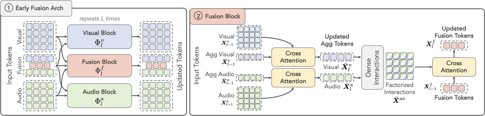
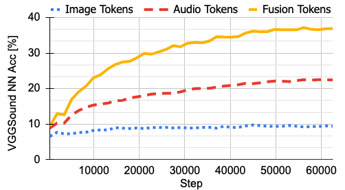
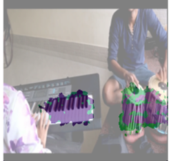
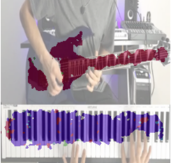
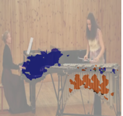

# Masked Autoencoders enable strong Audio-Visual Early Fusion 

>Official codebase and pre-trained models for our DeepAVFusion framework as described in the paper.
>
>**[Unveiling the Power of Audio-Visual Early Fusion Transformers with Dense Interactions through Masked Modeling](https://arxiv.org/pdf/2312.01017)**  
>[Shentong Mo](https://scholar.google.com/citations?user=6aYncPAAAAAJ&hl=en), [Pedro Morgado](https://pedro-morgado.github.io/)<br>
>IEEE/CVF Conference on Computer Vision and Pattern Recognition, 2024.

<div align="center">
  
</div>

## Setup


### Environment
Our environment was created as follows

```bash
conda create -n deepavfusion python=3.10
conda activate deepavfusion
conda install pytorch=2.0 torchvision=0.15 torchaudio=2.0 pytorch-cuda=11.8 -c pytorch -c nvidia
pip install submitit hydra-core av wandb tqdm scipy scikit-image scikit-learn timm mir_eval jupyter matplotlib
```

Simply run `conda env create -f requirements.yml` to replicate it.

### Datasets
In this work, we used a variety of datasets, including VGGSound, AudioSet, MUSIC and AVSBench. 
We assume that you have downloaded all datasets. Expected data format is briefly described in [DATASETS.md](DATASETS.md)
```bash
PATH2VGGSOUND="/path/to/vggsound"
PATH2AUDIOSET="/path/to/audioset"
PATH2MUSIC="/path/to/music"
PATH2AVSBENCH="/path/to/avsbench"
```

## DeepAVFusion Pre-training
We release two models based on the VIT-Base architecture, trained on the VGGSounds and AudioSet datasets, respectively.
The models were trained with the following commands.

```bash
# Pre-training on VGGSounds
PYTHONPATH=. python launcher.py --config-name=deepavfusion job_name=deepavfusion_vitb_vggsound_ep\${opt.epochs} \
  data.dataset=vggsound data.data_path=${PATH2VGGSOUND} \
  model.fusion.layers=all model.fusion.attn_ratio=0.25 model.fusion.mlp_ratio=1.0 \
  opt.epochs=200 opt.warmup_epochs=40 opt.batch_size=64 opt.accum_iter=1 opt.blr=1.5e-4 \
  env.ngpu=8 env.world_size=1 env.seed=0
  
# Pre-training on AudioSet
PYTHONPATH=. python launcher.py --config-name=deepavfusion job_name=deepavfusion_vitb_as2m_ep\${opt.epochs} \
  data.dataset=audioset data.data_path=${PATH2AUDIOSET} \
  model.fusion.layers=all model.fusion.attn_ratio=1.0 model.fusion.mlp_ratio=4.0 \
  opt.epochs=200 opt.warmup_epochs=40 opt.batch_size=64 opt.accum_iter=4 opt.blr=1.5e-4 \
  env.ngpu=8 env.world_size=1 env.seed=0 
```

The nearest neighbor training curve of the model trained on VGGSound can be seen below. 
The retrieval performance of fusion tokens is substantially better  than uni-modal representations, suggesting 
that fusion tokens aggregate high-level semantics, while uni-modal representations encode the low-level
details required for masked reconstruction.
<div align="center">
  
</div>

The pre-trained models are available in the `checkpoints/` directory.

## Downstream tasks
We evaluate our model on a variety of downstream tasks. In each case, the pre-trained model is used for 
feature extraction (with or without fine-tuning depending on the evaluation protocol) and a 
task-specific decoder is trained from scratch to carry the task.

### Audio Event Recognition

| Dataset  | Eval Protocol | Pre-trained Model | Top1 Acc |                                                                                                                                                                                                                                                                                                                                                                                                                        |
|:--------:|:-------------:|:-----------------:|:--------:|------------------------------------------------------------------------------------------------------------------------------------------------------------------------------------------------------------------------------------------------------------------------------------------------------------------------------------------------------------------------------------------------------------------------|
| VGGSound | Linear Probe  |  VGGSound-200ep   |  53.08   | <details><summary>CMD</summary>```PYTHONPATH=. python launcher.py --config-name=linprobe job_name=eval_linprobe_vggsound pretrain_job_name=deepavfusion_vitb_vggsound_ep200 model.fusion.attn_ratio=0.25 model.fusion.mlp_ratio=1.0 data.dataset=vggsound data.data_path=${PATH2VGGSOUND} opt.epochs=60 opt.warmup_epochs=10 opt.batch_size=64 opt.accum_iter=4 opt.blr=0.3 env.ngpu=4 env.world_size=1```</details>   |
| VGGSound | Linear Probe  | AudioSet2M-200ep  |  53.08   | <details><summary>CMD</summary>```PYTHONPATH=. python launcher.py --config-name=linprobe job_name=eval_linprobe_vggsound pretrain_job_name=deepavfusion_vitb_as2m_ep200 model.fusion.attn_ratio=1.0 model.fusion.mlp_ratio=4.0 data.dataset=vggsound data.data_path=${PATH2VGGSOUND} opt.epochs=60 opt.warmup_epochs=10 opt.batch_size=64 opt.accum_iter=4 opt.blr=0.3 env.ngpu=4 env.world_size=1```</details>        |
| VGGSound |  Fine-tuning  |  VGGSound-200ep   |  58.19   | <details><summary>CMD</summary>```PYTHONPATH=. python launcher.py --config-name=finetune job_name=eval_finetune_vggsound pretrain_job_name=deepavfusion_vitb_vggsound_ep200 model.fusion.attn_ratio=0.25 model.fusion.mlp_ratio=1.0 data.dataset=vggsound data.data_path=${PATH2VGGSOUND} opt.epochs=100 opt.warmup_epochs=20 opt.batch_size=32 opt.accum_iter=4 opt.blr=3e-4 env.ngpu=4 env.world_size=1```</details> |
| VGGSound |  Fine-tuning  | AudioSet2M-200ep  |  57.91   | <details><summary>CMD</summary>```PYTHONPATH=. python launcher.py --config-name=finetune job_name=finetune_vggsound pretrain_job_name=deepavfusion_vitb_as2m_ep200 model.fusion.attn_ratio=1.0 model.fusion.mlp_ratio=4.0 data.dataset=vggsound data.data_path=${PATH2VGGSOUND} opt.epochs=100 opt.warmup_epochs=20 opt.batch_size=32 opt.accum_iter=4 opt.blr=3e-4 env.ngpu=4 env.world_size=1```</details>           |

|   Dataset    | Eval Protocol | Pre-trained Model | Top1 AP |                                                                                                                                                                                                                                                                                                                                                                                                                                |
|:------------:|:-------------:|:-----------------:|:-------:|--------------------------------------------------------------------------------------------------------------------------------------------------------------------------------------------------------------------------------------------------------------------------------------------------------------------------------------------------------------------------------------------------------------------------------|
| AudioSet-Bal | Linear Probe  |  VGGSound-200ep   |  53.08  | <details><summary>CMD</summary>```PYTHONPATH=. python launcher.py --config-name=linprobe job_name=eval_linprobe_as2mbal pretrain_job_name=deepavfusion_vitb_vggsound_ep200 model.fusion.attn_ratio=0.25 model.fusion.mlp_ratio=1.0 data.dataset=audioset-bal-orig data.data_path=${PATH2AUDIOSET} opt.epochs=300 opt.warmup_epochs=20 opt.batch_size=256 opt.accum_iter=1 opt.blr=0.3 env.ngpu=2 env.world_size=1```</details> |
| AudioSet-Bal | Linear Probe  | AudioSet2M-200ep  |  53.08  | <details><summary>CMD</summary>```PYTHONPATH=. python launcher.py --config-name=linprobe  job_name=eval_linprobe_as2mbal pretrain_job_name=deepavfusion_vitb_as2m_ep200 model.fusion.attn_ratio=1.0 model.fusion.mlp_ratio=4.0 data.dataset=audioset-bal-orig data.data_path=${PATH2AUDIOSET} opt.epochs=300 opt.warmup_epochs=20 opt.batch_size=256 opt.accum_iter=1 opt.blr=0.3 env.ngpu=2 env.world_size=1```</details>     |
| AudioSet-Bal |  Fine-tuning  |  VGGSound-200ep   |  58.19  | <details><summary>CMD</summary>```PYTHONPATH=. python launcher.py --config-name=finetune job_name=eval_finetune_as2mbal pretrain_job_name=deepavfusion_vitb_as2m_ep200 model.fusion.attn_ratio=1.0 model.fusion.mlp_ratio=4.0 data.dataset=audioset-bal-orig data.data_path=${PATH2AUDIOSET} opt.epochs=200 opt.warmup_epochs=20 opt.batch_size=32 opt.accum_iter=4 opt.blr=3e-4 env.ngpu=4 env.world_size=1```</details>      |
| AudioSet-Bal |  Fine-tuning  | AudioSet2M-200ep  |  57.91  | <details><summary>CMD</summary>```PYTHONPATH=. python launcher.py --config-name=finetune job_name=eval_finetune_as2mbal pretrain_job_name=deepavfusion_vitb_vggsound_ep200 model.fusion.attn_ratio=0.25 model.fusion.mlp_ratio=1.0 data.dataset=audioset-bal-orig data.data_path=${PATH2AUDIOSET} opt.epochs=200 opt.warmup_epochs=20 opt.batch_size=32 opt.accum_iter=4 opt.blr=3e-4 env.ngpu=4 env.world_size=1```</details> |

### Visually Guided Source Separation

|    Dataset     |   Pre-training   | SDR  | SIR  |  SAR  |                                                                                                                                                                                                                                                                                                                                                                                                                                                                                                                          |
|:--------------:|:----------------:|:----:|:----:|:-----:|--------------------------------------------------------------------------------------------------------------------------------------------------------------------------------------------------------------------------------------------------------------------------------------------------------------------------------------------------------------------------------------------------------------------------------------------------------------------------------------------------------------------------|
| VGGSound-Music |  VGGSound-200ep  | 5.79 | 8.24 | 13.82 | <details><summary>CMD</summary>```PYTHONPATH=. python launcher.py --config-name=avsrcsep job_name=eval_avsrcsep_vggsound_music pretrain_job_name=deepavfusion_vitb_vggsound_ep200 model.fusion.attn_ratio=0.25 model.fusion.mlp_ratio=1.0 data.dataset=vggsound_music data.data_path=${PATH2VGGSOUND} opt.epochs=300 opt.warmup_epochs=40 opt.batch_size=16 opt.accum_iter=8 opt.blr=3e-4 avss.log_freq=True avss.weighted_loss=True avss.binary_mask=False avss.num_mixtures=2 env.ngpu=4 env.world_size=1```</details> |
| VGGSound-Music | AudioSet2M-200ep | 6.93 | 9.93 | 13.49 | <details><summary>CMD</summary>```PYTHONPATH=. python launcher.py --config-name=avsrcsep job_name=eval_avsrcsep_vggsound_music pretrain_job_name=deepavfusion_vitb_as2m_ep200 model.fusion.attn_ratio=1.0 model.fusion.mlp_ratio=4.0 data.dataset=vggsound_music data.data_path=${PATH2VGGSOUND} opt.epochs=300 opt.warmup_epochs=40 opt.batch_size=16 opt.accum_iter=8 opt.blr=3e-4 avss.log_freq=True avss.weighted_loss=True avss.binary_mask=False avss.num_mixtures=2 env.ngpu=4 env.world_size=1```</details>      |


### Audio Visual Semantic Segmentation

|   Dataset   |   Pre-training   | mIoU  | FScore |                                                                                                                                                                                                                                                                                                                                                                                                                   |
|:-----------:|:----------------:|:-----:|:------:|-------------------------------------------------------------------------------------------------------------------------------------------------------------------------------------------------------------------------------------------------------------------------------------------------------------------------------------------------------------------------------------------------------------------|
| AVSBench-S4 | VGGSounds-200ep  | 89.94 | 92.34  | <details><summary>CMD</summary>```PYTHONPATH=. python launcher.py --config-name=avsegm job_name=eval_avsbench_s4 pretrain_job_name=deepavfusion_vitb_vggsound_ep200 model.fusion.attn_ratio=0.25 model.fusion.mlp_ratio=1.0 data.dataset=avsbench_s4 data.data_path=${PATH2AVSBENCH} opt.epochs=100 opt.warmup_epochs=20 opt.batch_size=16 opt.accum_iter=8 opt.blr=2e-4 env.ngpu=4 env.world_size=1```</details> |
| AVSBench-S4 | AudioSet2M-200ep | 90.27 | 92.49  | <details><summary>CMD</summary>```PYTHONPATH=. python launcher.py --config-name=avsegm job_name=eval_avsbench_s4 pretrain_job_name=deepavfusion_vitb_as2m_ep200 model.fusion.attn_ratio=1.0 model.fusion.mlp_ratio=4.0 data.dataset=avsbench_s4 data.data_path=${PATH2AVSBENCH} opt.epochs=100 opt.warmup_epochs=20 opt.batch_size=16 opt.accum_iter=8 opt.blr=2e-4 env.ngpu=4 env.world_size=1```</details>      |


## Demonstrations

<details>
<summary>Demo 1</summary>


Original Video
---
https://github.com/stoneMo/EFAV/assets/13263161/c627a9fa-6d1a-4f00-b4a6-4767f3b15637

Localized Sources
---


Separated Source #1
---
https://github.com/stoneMo/EFAV/assets/13263161/f4d26138-eb91-4ab5-b559-f286605792aa

Separated Source #2
---
https://github.com/stoneMo/EFAV/assets/13263161/bf4ebf1f-e0dd-4639-be2a-ab9e0af7b254

</details>


<details><summary>Demo 2</summary><p>

Original Video
---
https://github.com/stoneMo/EFAV/assets/13263161/26c848f1-c089-4a95-bce1-52c8fc18097f

Localized Sources
---


Separated Source #1
---
https://github.com/stoneMo/EFAV/assets/13263161/2815793b-a7e0-4501-9e33-14890455a57b

Separated Source #2
---
https://github.com/stoneMo/EFAV/assets/13263161/fcb22a57-76c7-4444-bde1-7e4965ac748f

</p></details>


<details><summary>Demo 3</summary><p>

Original Video
---
https://github.com/stoneMo/EFAV/assets/13263161/660d54e8-fc2f-4cc0-8853-1f419a339637

Localized Sources
---


Separated Source #1
---
https://github.com/stoneMo/EFAV/assets/13263161/0e8ad878-66ee-4a01-945b-54d5f9238fb0

Separated Source #2
---
https://github.com/stoneMo/EFAV/assets/13263161/97d329e8-35dd-4f28-a73e-ef423454a3e5

</p></details>


<details><summary>Demo 4</summary><p>

Original Video
---
https://github.com/stoneMo/EFAV/assets/13263161/5df65af7-f7e7-4fe9-8a31-b6371b0dc52c

Localized Sources
---


Separated Source #1
---
https://github.com/stoneMo/EFAV/assets/13263161/4b442f8c-d938-4cd8-9f57-e1f139d4da0c

Separated Source #2
---
https://github.com/stoneMo/EFAV/assets/13263161/185a3bf3-5158-4055-8c24-1bcb7b1b8e51

</p></details>


## Citation

If you find this repository useful, please cite our paper:
```
@inproceedings{mo2024deepavfusion,
  title={Unveiling the Power of Audio-Visual Early Fusion Transformers with Dense Interactions through Masked Modeling},
  author={Mo, Shentong and Morgado, Pedro},
  booktitle={Proceedings of the IEEE/CVF Conf. on Computer Vision and Pattern Recognition (CVPR)},
  year={2024}
}
```
