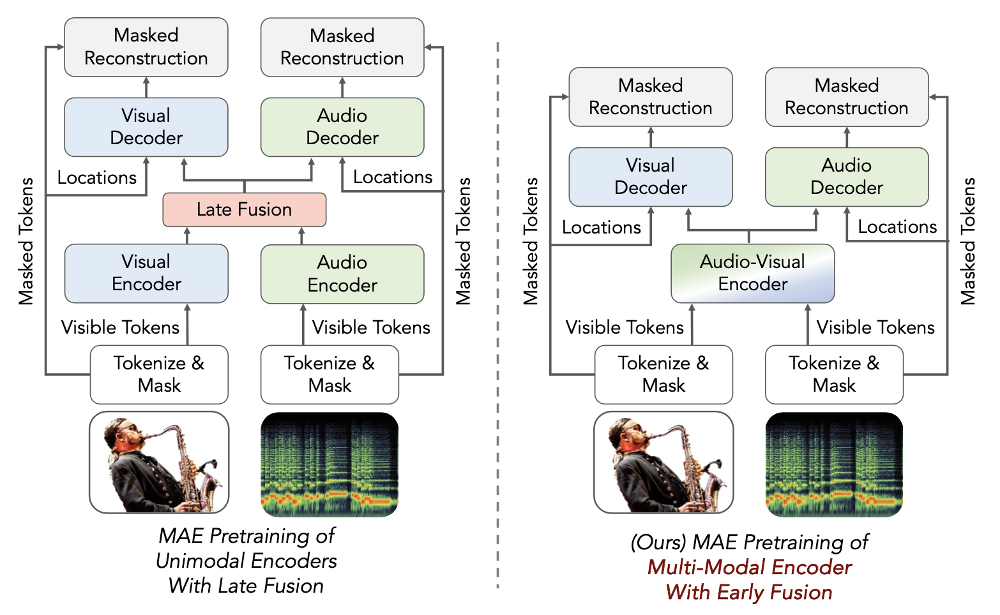

# Unveiling the Power of Audio-Visual Early Fusion Transformers with Dense Interactions through Masked Modeling

We will release our code soon! 

DeepAVFusion is a novel attention-based fusion framework that can attend to local audio-visual interactions, and learn deeply integrated audio-visual representations.

[**Unveiling the Power of Audio-Visual Early Fusion Transformers with Dense Interactions through Masked Modeling**](https://arxiv.org/abs/2312.01017)
<br>Shentong Mo, Pedro Morgado<br>
arXiv 2023.

<div align="center">
  
</div>


## Citation

If you find this repository useful, please cite our paper:
```
@article{mo2023deepavfusion,
  title={Unveiling the Power of Audio-Visual Early Fusion Transformers with Dense Interactions through Masked Modeling},
  author={Mo, Shentong and Morgado, Pedro},
  journal={arXiv preprint arXiv:2312.01017},
  year={2023}
}
```